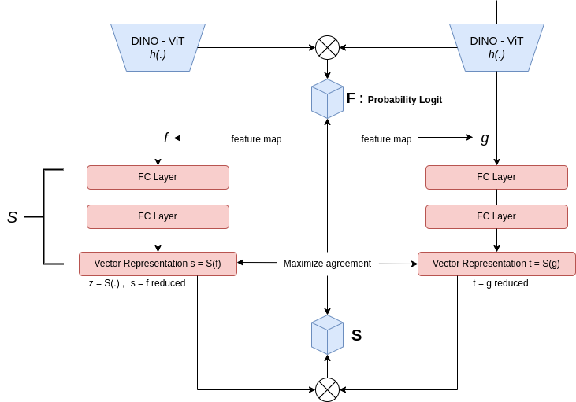

# STEGO Paper Notes
---
## Context / Contexte

Pour effectuer une segmentation sémantique, des jeux de données annotés au niveau du pixel sont importants. Néamoins, dans la réalité, de tels ensembles de données ne sont pas toujours disponibles en raison du coût élevé de l'annotation des images. Ce qui signifie qu'un effort humain considérable doit être fait dans la simple création d'étiquettes, de plus, pour certaines thématiques, l'étiquetage des données néccessite une bonne expertise du domaine de la part de l'annotateur. Prenons par exemple le cas des images médicales de cancer, il faut ếtre un spécialiste aguéri pour catégoriser l'ensemble de pixels d'une tumeur de benigne ou non.

L'apprentissage non-supervisé / auto-supervisé (self-supervised learning) vise à résoudre ce problème en permettant aux algorithmes de Machine Learning de générer des modèles prédictifs sans données étiquetées, par un opérateur humain.

Une telle segmentation sémantique, non-supervisée présente des avantages a savoir, la réduction du coût de l'annotation et la découverte de classes qui ne pouvait être identifiées par l'homme.

## Problem Statement / Probleme de recherche

Considérons la tâche de cartographie d'un corpus d'images, en utilisant une approche de segmentation sémantique non supervisée.

Pour un jeu de données non-étiqueté dans un domaine $D$, la tâche sous la main a pour objectif de, determiner un ensemble de classes visibles **$C$** dans une image et d'apprendre une fonction **$f$** qui va attribuer une de ces classes a chaque pixel de l'image prise dans **$D$.**

## Background / Travaux Connexes

Cet article tire son inspiration au travers du succès des travaux antérieurs basés sur un apprentissage auto-supervisé de features, à l'instar de l'apprentissage contrastif (ou de comparaison, qui neccéssite des examples négatifs pour fonctionner). En effet, ces différentes méthodes apprenent les features globaux d'un jeu de données sans l'utilisation de labels, en entrainant un modele a reconnaitre les paires de pixels similaires et différentes, afin d'apprendre des caractéristiques de haut niveau sur les données, et ceci avant d'effectuer une tâche de classification ou de segmentation.

Plus précisément, nous avons une image et nous l'augmentons de différentes manières. Ensuite, nous présentons ces deux images au modèle qui apprend deux copies du même réseau (poids partagés), et nous laissons le modèle décider ce qui suit : en regardant ces deux entrées, elles peuvent sembler différentes mais elles sont en fait les mêmes (elles proviennent de la même image). Nous pouvons donc voir comment cet objectif peut nous donner une sorte de représentation parce que le modèle apprend les correspondances entre les caractéristiques à partir d'entrées similaires (quel genre de contenu est susceptible d'être présent sur la même image).

## Main Idea / Idée générale

La méthode de l'article présenté dans ces notes, **STEGO**, permet de segmenter (sémantiquement) le contenu des images d'un corpus, en des **ontologies connues.** Notons ici que, le terme **ontologie** renvoie à **une classe d'objets** du monde réel. En d'autres mots, la méthode **STEGO** consiste pour une image, à prédire des classes pour chaque objet qui ont les mêmes motifs que les features de ces derniers. Pour ce faire, les auteurs prennent des images et les caractérisent à l'aide d'un transformateur visuel qu'ils ont figé à l'avance, puis extraient la matrice de corrélation de ces features pour servir de signal de supervision. En outre, ils apprennent une légère transformation qu'ils appellent la tête de segmentation, qui n'est simplement qu'un réseau de projection où se tient une réduction de dimensionnalité, ce qui produira des representations de segmentation. Ces dernières distilleront et amplifieront probablement la structure des features. À la fin, les auteurs répliquent ce processus sur des paires, d'images et de k-voisins les plus proches, sur des images et elles mêmes, sur des images et d'autres images aléatoires de la même collection d'images en entrée.

## Method / Méthode

STEGO apprend les représentations de features en maximisant l'alignement des motifs via une perte contrastive dans l'espace latent. L'objectif étant que le modèle produise des représentations similaires pour des images similaires. 

De facon analogique a l'architecture classique d'un CNN, le processus entier de l'architecture du modèle peut être décrit en 3 étapes formant la partie baseline :

> **Sélection des features / Extraction de caractéristiques**

La sélection des caractéristiques est le processus d'identification d'un sous-ensemble des caractéristiques les plus utiles qui produit des résultats compatibles avec l'ensemble des caractéristiques d'origine. Les caractéristiques fournissent des informations sur le jeu de données. Dans la représentation de données de haute dimension, chaque échantillon est décrit par de nombreuses caractéristiques. Les jeux de données ne sont généralement pas spécifiques à une tâche, de nombreuses caractéristiques sont non pertinentes ou redondantes et doivent être éliminées ou filtrées dans le but de classer les objets cibles. Étant donné un ensemble de caractéristiques, le problème de la sélection des caractéristiques consiste à trouver un sous-ensemble de caractéristiques qui "maximise la capacité d'un modèle à classifier des motifs". 

**1. Extraction**

En utilisant un modèle pré-entrainé, DINO dans ce cas, que nous pouvons considérer une simple fonction $h = f_o$ pour cette étape, qui vise à obtenir les descripteurs sémantiques (*feature maps*) pour une paire d'images en entrée.

Soit une image non étiquétée $x_i(i=1,...,n)$, l'extracteur $f_o$ obtient une matrice de caractéristiques $f_o(x)$, avec $f_o(x)[p]$ la représentation correspondante au pixel $p$. 

**2. Réduction **

Les sorties de $f_o$ sont ensuite utilisées comme entrée dans un MLP (réseau entièrement connecté) appélé tête de segmentation, $z = S(h)$ pour transformer les données en entrée dans un autre espace (ici il s'agit de l'espace de code des couleurs RVB). Les auteurs ont montré que cette étape améliore les performances du modèle.

En projetant les images dans une représentation spatiale latente, le modèle est capable d'apprendre les caractéristiques de haut niveau. En effet, en continuant d'entrainer le modèle pour maximiser la similarité vectorielle entre des images similaires, nous pouvons imaginer que le modèle apprend des groupes de points de données similaires dans l'espace latent.

Par conséquent pour la formation des clusters après extraction des caractéristiques, il nous faut appliquer une transformation $z$ sur ces features maps (fonction de correspondance d'une dimension $D$ vers une dimension $d$ plus petite)

Pour bien comprendre cette fonction, énoncons le problème à résoudre ici.

Soient $f$ et $g$ les features maps associées aux images $x$ et $y$ (similaires), les transformations $S(f)$ et $S(g)$ (qui permettent de préserver la relation de voisinage entre les points de données) produisent des vecteurs de segmentation comme suit:

- si deux points de données sont similaires avant la transformation, ils doivent être plus proches après la transformation, c'est à dire que la distance entre eux doit être petite (*small*)

- si deux points de données sont différents avant la transformation, ils doivent être éloignés l'un de l'autre, c'est à dire que la distance entre les deux doit être grande (*large*)

Il est logique que lorsque deux vecteurs sont plus proches (angle plus petit entre eux) ensemble dans l'espace, ils sont plus similaires. Ainsi, si nous prenons le cosinus (angle entre les deux vecteurs) comme métrique , nous obtiendrons une forte similarité lorsque l'angle est proche de 0, et une faible similarité sinon.

> **Minimisation de la perte**

Maintenant que nous avons deux vecteurs, $z$ , nous avons besoin d'un moyen de quantifier la similarité entre eux. Notons ici que, pour deux images similaires, il devrait avoir une grande correspondance entre les vecteurs de segmentation $z$ produits (ils partagent un grand nombre de motifs similaires).

Puisque nous comparons deux vecteurs, le choix naturel des auteurs est le cosinus de similarité (comme expliqué plus haut).

Pour calculer la perte du MLP, continuons l'analogie avec les CNN, dans le cas d'un CNN, il faut comparer les prédictions avec les labels, dans notre cas nous avons pas de labels mais rappelons quand même qu'à l'étape 1, les features maps produites (étant d'assez bonne qualité que des images étiquettes) peuvent être considérées comme des pseudo-labels. 

Cependant, au lieu d'essayer de classer un $z_i$ à un $h_j$, nous voudrions prédire si une paire ($z_i$, $h_j$) correspond ou pas. En d'autres mots, trouver si pour tout élément de z prédit, il y a **compatibilité** avec un élément de h.

En un langage plus compréhensible, l'objectif est de maximiser l'alignement de deux images similaires (ne pas oublier le cas d'images non similaires), ce qui revient à : vérifier si pour deux images similaires

1. Calculer le degré/score de similarité des étiquettes des images en entrée. Les auteurs le font par le biais d'une matrice de corrélation $F$ entre les $2$ feature maps $f$ et $g$, chaque score est sauvegardé comme label de similarité/**compatibilité** entre une paire d'éléments de $f$ et $g$.
 
2. Calculer le degré/score de similarité des $2$ vecteurs de segmentation $s$ et $t$. La matrice de corrélation $S$, obtenue est considérée comme la valeur de prédiction du MLP. 
 
3. La matrice $S$ est donc comparer à la valeur étiquette $F$ pour évaluer leur niveau de compatibilité.

- Est-ce qu'il y a compatibilité entre les prédictions et les étiquettes ? Si non, alors le rapprochement qui a été effectué dans l'espace latent est à revoir et pour cela, mise à jour des poids du MLP.

- Nouveaux regroupements des points de données des $2$ vecteurs $z$

- Production de la matrice de correspondance entre les vecteurs

- Calcul de l'erreur avec la matrice étiquette, puis la boucle recommence ! (jusqu'a ce l'erreur soit minimisée au max) :sweat_smile:

  La fonction d'erreur calculée est donc : $L_s = - \sum_{hwij} (F_hwij - b) * S_hwij$

Pour deux vecteurs de segmentation $s$ et $t$ jugés similaires, le module de perte essaye de rapprocher les points de données similaires de ces vecteurs si il existe une corrélation entre des points de données de leurs représentations $f$ et $g$, évoluant de la même façon. C'est à dire que, il existe des points de données de $f$ et $g$ qui, lorsqu'ils sont proches produisent des vecteurs de segmentation similaires et lorsqu'ils sont différents produisent des vecteurs différents.

Pour résumé, en fonction du résultat de correspondance entre les vecteurs de segmentations, on doit aligner / éloigner les prédictions avec les pseudo-labels. Ce qui revient à calculer **la distance** entre les matrices de correlations des données en entrée et en sortie du module de classification $F$et $S$ (les poids de l'extracteur ne sont pas mis à jour, le réseau est figé). 

La fonction d'erreur vise donc à **minimiser** cette distance de façon à maximiser l'alignement des prédictions et des pseudo-labels. Le résultat de cette étape est d'accentuer la structure des clusters identifiés (le rapprochement entre les points de données au niveau du MLP produit des groupes donc des clusters).

Petite anecdote : pourquoi il y a moins (-) devant la fonction d'erreur ?
   A toutefois qu'il y a un problème de **maximisation**, il s'agit en réalité d'une minimisation de **l'opposé** d'une fonction de coût. :sunglasses:

> Introduction des biais

Par addition au processus d'apprentissage décrit ci-dessus, les auteurs introduisent plusieurs biais, ce qui entraine une modification de la fonction d'erreur pour s'adapter aux différentes observations présentées dans l'article, et que nous élaborerons ultérieurement.

> **Clustering / Classification**

Après avoir réduit la dimensionnalité des vecteurs $z$, les auteurs appliquent l'algorithme de clustering sur les feature maps **réduites** (ce que j'ai appelé les vecteurs de segmentation) pour extraire les clusters précédemment identifiés. 

- En effet il y a classification (assignation à un cluster), de chaque pixel d'une image dans le jeu de données en utilisant la représentation courante des caractéristiques (segmentation features) et la méthode **K-Means** (la méthode utilisée dans l'article est celle du **Mini Batch K-Means**).

  $min_{y,\mu}\sum_{i,p} ||f_\theta(x_i)[p]-\mu_{y_{ip}}||^2$

 où $y_{ip}$ désigne l'étiquette de cluster du $p$ème pixel de la $i$ème image et $\mu_k$ désigne le point central (centre de gravité) du $k$ème cluster.
 
 > **Optimisation** 

De nombreuses méthodes de segmentation utilisent les **CRFs** comme méthode pour post-traiter les résultats de sortie finaux. L'idée est d'encourager les pixels qui ont de fortes relations spatiales et de caractéristiques à avoir la même étiquette. 

Le résultat du clustering conduit certe à une formation des clusters clairement visibles, néamoins, on peut remarquer que, certaines extrêmités des objets identifiés sont rugueuses et présentent parfois des discontinuités. Les auteurs utilisent donc un **CRF** à la fin du process pour intégrer la structure des objets. Ce **CRF** en effet, va tenir compte de la correlation entre les pixels d'un même objet contrairement aux étapes précédentes qui s'attardent sur la relation entre les classes. 

Ce raffinement adapte donc la sortie pour tenir compte des délimitations sémantiques des objets, conduisant à une meilleure segmentation.

---
## Takeaways / Résumé

Ici nous présentons ce que nous retenons de l'article et améliorons les explications plus haut.

> **Feature Similarity Learning / Apprentissage des correspondances entre les caractéristiques**

L'objectif principal est d'apprendre une fonction de similarité entre les descripteurs de caractéristiques. Étant donné deux représentations $G_1$,$G_2$ , un modèle de similarité de représentations peut être écrit comme une fonction $f(G_1,G_2)$ qui calcule une valeur scalaire de similarité.

Dans cet article, les auteurs construisent donc un modèle (MLP) pour apprendre une telle fonction de similarité sur la base d'exemples de paires similaires/différents.

Nous pouvons également utiliser le terme **distance** et dire que le modèle apprend une **fonction de distance**  $d(G_1,G_2)$ entre les représentations (intermédiaires). Notons tout de même que, une fonction de distance c'est juste le contraire d'une fonction de similarité, et nous pouvons simplement dire $f(G_1,G_2) = − d(G_1,G_2)$.

> **STEGO Architecture in one Paragraph / Architecture de STEGO en un paragraph**

Le modèle présenté dans l'article suit trois étapes principales. Tout d'abord, les features (f) sont extraites à l'aide d'un réseau pré-entrainé à savoir **DINO**. Ensuite, un **MLP** utilise ces features (f) pour produire des représentations réduites et une matrice de correspondance $S$ qui calcule les degrés de similarité entre les représentations réduites point par point. À partir des mêmes features maps (f), une matrice de correspondance $F$ déduit des scores de compatibilité par paires entre les pixels. Enfin, la matrice $F$ est utilisée comme **signal de supervision** pour le calcul de l'erreur du **MLP** contre la matrice $S$. Ce qui permet au modèle d'avoir des représentations alignées avec les étiquettes auxilliaires (f). Ensuite, l'algorithme de K-Means va extraire les clusters identifiables des représentations alignées formant dès lors les masques de segmentation recherchés. Pour produire un masque de segmentation final,  le **CRF** utilisé encourage les pixels voisins à avoir des probabilités similaires en fonction de leurs similitudes sémantiques. De ce fait, les segmentations prédites sont amenées à prendre la forme des objets d'intérêt.

scores de classe pixel par pixel
---
## Application to underwater imagry / Application à l'imagerie sous-marine

### Caractéristiques des données / Data Characteristics

À la différence des images naturelles terrestres, les images sous-marines se caractérisent par une forte dominance de couleurs bleutées et verdâtres. Par ailleurs, la forte atténuation de la lumière dans l’eau par rapport à l’air et une plus forte diffusion de la lumière incidente ont pour conséquence de réduire considérablement la visibilité. Ainsi, des objets se trouvant à une distance lointaine du système d’acquisition ou de l’observateur mais aussi à une distances moyenne, voire même relativement courte dans certains cas, sont difficilement visibles et faiblement contrastés par rapport à leur environnement.

### Challenges / Défis

L’utilisation d’images sous-marines est difficile car l’eau introduit d’importantes contraintes. En effet, la qualité des images est fortement dégradée par les effets variables qu’introduit l’eau sur la propagation des signaux. Les principales causes de cette dégradation sont dues à la présence de particules en suspension (sable, plancton, algues, etc...), aux problèmes d’éclairage ainsi qu’à l’absorption de l’énergie lumineuse. De plus, la distorsion des couleurs et les effets de flou changent au fil des saisons. Dans cette situation, le modèle de vision formé avec des images brutes peut ne pas être performant. Par conséquent, il faut envisager un processus d'amélioration (pré-traitement) de l'image pour normaliser toutes les images dans une vue claire. 

---

## About the project / A propos du projet :robot:

> **Questions / Questions**

1. Ce projet se focalise sur la tâche de segmentation de quels types objets ? Les objets d'intérêt représentant les classes à assigner, exemple : animaux, plantes, plastique, capteurs, etc

2. Quelle est l'application directe ou indirecte de ce projet ? Exemple : système automatique de nettoyage des dechets marins, dont la base est naturellement de comprendre les différents objets présents dans l'eau.

> **En savoir plus / More** :massage_woman:

Pour revenir à la notion d'ontologie présentée dans l'idée générale de l'article, des exemples d'ontologies pour le cas de la cartographie sous-marine pourraient être :

1. Animaux : crabe, anguille, étoile de mer, coquillage, poisson, calamar, requin, dauphin, corail, anémone de mer, etc... Pour aller plus loin on peut classer ce vocabulaire en deux groupes, celui des vertébrés et des invertébrés et ainsi établir les relations entre les éléments du vocabulaire et les groupes sous forme de ramifications.

            les animaux (aquatiques)
                     |
              les vertébrés
               /     |    \         
         poisson, requin, dauphin, etc...

2. plantes : algue, plancton, herbier marin, etc...

3. Les dechets : le materiel de pêche, le plastiques, papier, caoutchouc, bois, etc...
